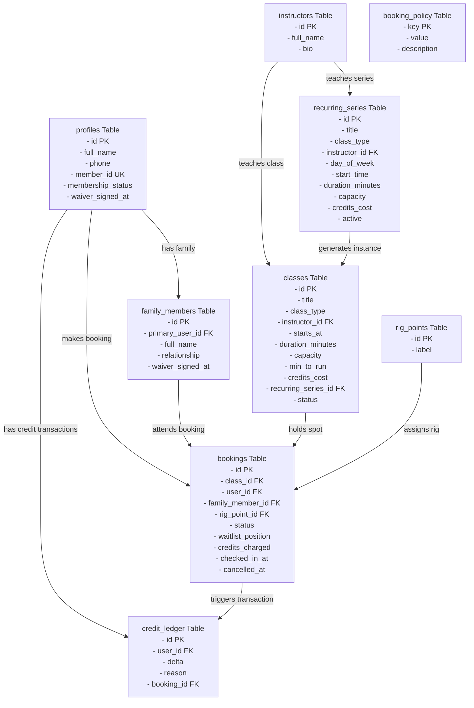

# Evolve Booking System: Database Relationships & Flows

This guide explains the database structure of the Evolve Booking System in plain English, highlighting how each table connects to others.

## Database Relationship Flowchart

---

## 1. Profiles & Account Management

### `public.profiles`
* **What it is:** Represents a registered member's profile. It extends Supabase's authentication registry to store studio-specific details.
* **Connections:**
  * **`id` (References `auth.users.id`):** Links the public profile to the secure login account managed by Supabase.
* **Fields:**
  * `member_id` (e.g., `EPF-01000`): Unique sequence-based identifier.
  * `membership_status` (Active, Inactive, Suspended): Represents whether the client has an active membership tier.
  * `waiver_signed_at`: The date/time a waiver was signed. If this is empty (null), the system blocks the user from booking.

### `public.family_members`
* **What it is:** Allows primary users to book classes on behalf of family members.
* **Connections:**
  * **`primary_user_id` (References `profiles.id`):** Points to the primary account holder who manages this member.
* **Fields:**
  * `full_name` & `relationship` (e.g., Spouse, Child).
  * `waiver_signed_at`: Family members must have their own waiver signed before check-in.

---

## 2. Instructors & Classes

### `public.instructors`
* **What it is:** The list of coaches/instructors at the studio.
* **Connections:**
  * Referenced by both `classes` and `recurring_series`.

### `public.recurring_series`
* **What it is:** Templates for weekly classes (e.g., "Pole Basics every Monday at 6:00 PM").
* **Connections:**
  * **`instructor_id` (References `instructors.id`):** Links the series template to a specific coach.

### `public.classes`
* **What it is:** Individual scheduled class sessions that clients can book (e.g., "Pole Basics on Monday, July 6 at 6:00 PM").
* **Connections:**
  * **`instructor_id` (References `instructors.id`):** The coach leading this specific session.
  * **`recurring_series_id` (References `recurring_series.id`):** The template series this class instance was generated from.

---

## 3. Physical Rig Points

### `public.rig_points`
* **What it is:** Represents the 5 physical ceiling grid mount attachments (`A1` to `A5`) in the studio.
* **Connections:**
  * Referenced by the `bookings` table to allocate a physical spot to a client.

---

## 4. Bookings & The Waitlist

### `public.bookings`
* **What it is:** Records spot reservations and waitlist queues.
* **Connections:**
  * **`class_id` (References `classes.id`):** The session being booked.
  * **`user_id` (References `profiles.id`):** The client account making the booking.
  * **`family_member_id` (References `family_members.id`):** If not null, represents a family member attending the class.
  * **`rig_point_id` (References `rig_points.id`):** The physical rig point reserved for the booking. If this is empty (null) and the status is `'waitlisted'`, it represents a waitlist entry.
* **Logical Relationships:**
  * A database constraint (`uniq_rig_point_per_class`) guarantees that a physical rig point can only be held by **one active booking per class** at any given moment.

---

## 5. Credits & Audit Trail

### `public.credit_ledger`
* **What it is:** An append-only log of all credit additions, deductions, and refunds.
* **Connections:**
  * **`user_id` (References `profiles.id`):** The profile whose balance is affected.
  * **`booking_id` (References `bookings.id`):** Links the credit transaction to a specific booking event.
* **Logical Flow:**
  * The ledger uses delta math (`+1` for refund, `-2` for booking, etc.). Balance queries simply sum the deltas for a user.

### `public.credit_balances` (View)
* **What it is:** A convenience view that aggregates all `delta` values in `credit_ledger` grouped by `user_id` to provide instantaneous balance checks.
