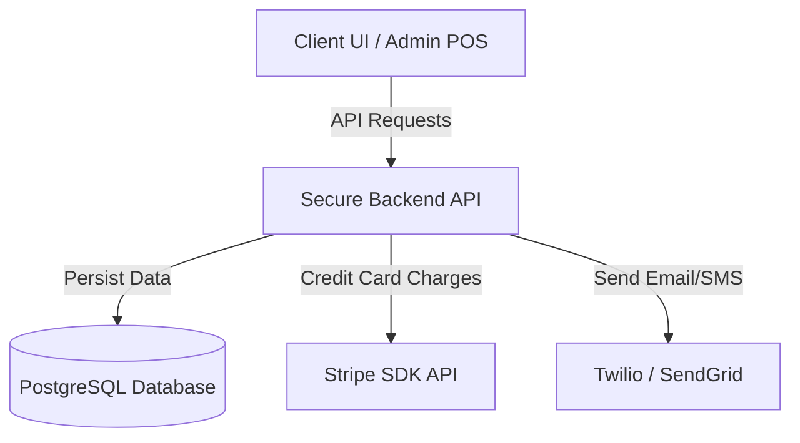

# Evolve Studio POS — Feature Recommendations & Roadmap

This document outlines the remaining unimplemented items from the master checklist, identifies functional POS gaps based on standard fitness studio workflows, and provides architectural recommendations to scale the platform.

---

## 📋 Unimplemented Master Checklist Items

These are the features currently defined in [CHECKLIST.md](file:///c:/Users/MYPC/Documents/Evolve%20by%20Cams%20-%20Clean/CHECKLIST.md) that remain unbuilt:

### 1. Reminders & Push Notification System
- [ ] **Class Reminders:** Auto-generate notification alerts reminding clients of their upcoming session 12–24 hours beforehand.
- [ ] **Waitlist Promotions:** Real-time push/in-app alert notifying a waitlisted client when a class spot opens up and they are promoted to active status.

---

## 🔍 POS & Workflow Feature Gaps

The current platform is an admin-centric Point-of-Sale (POS) dashboard. To transition into a production-grade management system, we recommend implementing the following high-value features:

### 1. Client Booking Portal (Self-Service)
Currently, all bookings, registrations, and credits top-ups must be handled manually by staff.
- **Recommendation:** Build a public-facing `/book` route allowing clients to sign up, log in, purchase packages online via Stripe, view live class schedules, select spots, and manage their reservations.

### 2. Promo Code & Campaigns Manager
We have hardcoded promo rules (such as `EVOLVE10`).
- **Recommendation:** Implement a management UI under `/admin/promos` where Cams can create custom promo codes, set expiration dates, limit usage counts, and specify discount percentages or flat rate amounts.

### 3. Inventory & Merchandise Sales
Studios often sell retail merchandise (e.g., grip socks, water, activewear).
- **Recommendation:** Add a `/merchandise` page supporting product listings, stock tracking, and sales transactions integrated directly into the client checkout log.

### 4. Instructor Scheduler & Payroll Dashboard
We generate analytics on coach revenue and occupancy, but payroll is manual.
- **Recommendation:** Build a payroll calculator that computes monthly instructor commissions based on:
  - Base pay per class taught.
  - Performance tier bonuses (e.g., extra payout if occupancy exceeds 80%).

---

## 🛠️ Technical & Architectural Recommendations

As transaction volume grows, the technical foundation will need to shift from simple local storage to a robust multi-user infrastructure.

### 1. Migrate Database from LocalStorage to PostgreSQL
- **Why:** `localStorage` is scoped to a single browser instance on one machine. If Cams accesses the dashboard from home and a front-desk staff member accesses it at the studio, they will see separate, out-of-sync databases.
- **Solution:** Migrate to a server-side backend (such as Supabase, Prisma, or Next.js API routes with a hosted PostgreSQL database) to centralize all clients, bookings, and transactions in a secure database.

### 2. Live Payment Integration
- **Why:** Current credit card sales run on a local mock environment (`StripeTerminalMock`).
- **Solution:** Integrate the production Stripe SDK and Webhook listeners to allow real credit card processing on checkout terminals and online portals.

### 3. Automated Messaging Channels
- **Why:** Notification states are currently browser-scoped alerts.
- **Solution:** Integrate external email and SMS APIs (such as **Twilio** or **SendGrid**) to deliver reminder messages directly to clients' mobile phones or email boxes.
