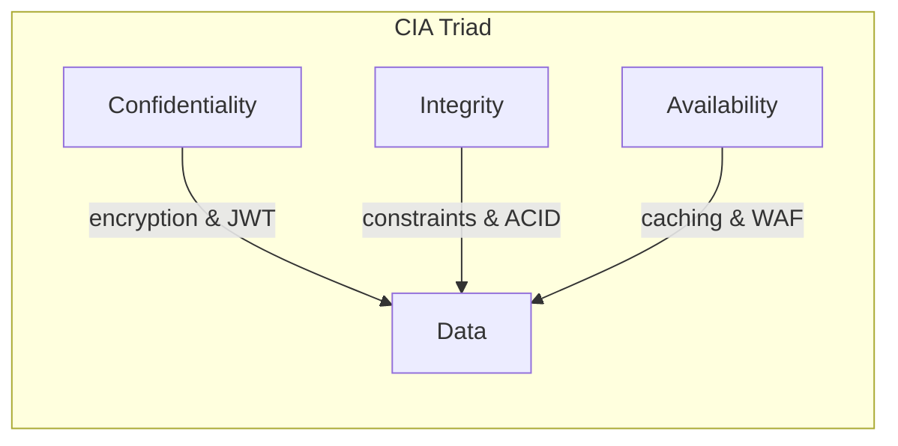
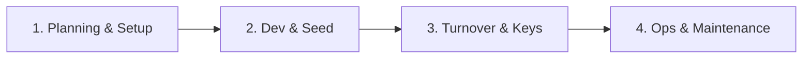

# Evolve Studio POS — Master Production Architecture, Database Blueprint, and System Turnover Plan

This document serves as the master production manual, database blueprint, access control guide, and turnover roadmap. It is designed to take the Evolve local prototype and transition it into a secure, multi-tenant cloud application.

---

## 👥 1. Role-Based Access Control (RBAC) & User Management

To enforce security and lease-privilege access, the system classifies users into four distinct tiers with defined account limitations.

### Access Control Matrix

| System Action | Super Admin / Owner (👑 Cams) | Front Desk Staff (🧑‍💻 Staff) | Instructor / Coach (👟 Sarah/Alex) | Client / Customer |
| :--- | :---: | :---: | :---: | :---: |
| Account Limits | **Single Account** | **Single Account** | **Multiple Accounts** | **Multiple Accounts** |
| Adjust Pricing & Tiers | ✅ Yes | ❌ No | ❌ No | ❌ No |
| Manually Credit Client | ✅ Yes | ❌ No (Read-Only) | ❌ No | ❌ No |
| Create/Edit Schedule | ✅ Yes | ❌ No | ❌ No | ❌ No |
| Process POS Purchases | ✅ Yes | ✅ Yes | ❌ No | ❌ No |
| Check In Booked Clients | ✅ Yes | ✅ Yes | ✅ Yes (Own Classes) | ❌ No |
| View Financial Analytics | ✅ Yes | ❌ No | ❌ No | ❌ No |
| Book/Cancel Spot | ✅ Yes (On Behalf) | ✅ Yes (On Behalf) | ❌ No | ✅ Yes (Own Spots) |

---

## 🗂️ 2. Production Database Blueprint (Supabase SQL Schema)

This SQL script can be copied and executed directly inside the **Supabase SQL Editor** to establish the database schema, relational keys, constraints, and triggers.

```sql
-- Enable UUID extension
CREATE EXTENSION IF NOT EXISTS "uuid-ossp";

-- 1. MEMBERSHIP TIERS
CREATE TABLE membership_tiers (
    id UUID PRIMARY KEY DEFAULT uuid_generate_v4(),
    title VARCHAR(100) UNIQUE NOT NULL,
    price DECIMAL(10, 2) NOT NULL DEFAULT 0.00,
    credits INT NOT NULL DEFAULT 0, -- 999 indicates Unlimited
    created_at TIMESTAMP WITH TIME ZONE DEFAULT TIMEZONE('utc', NOW()) NOT NULL
);

-- 2. CUSTOMERS (Linked to Supabase Auth)
CREATE TABLE customers (
    id UUID PRIMARY KEY REFERENCES auth.users(id) ON DELETE CASCADE,
    name VARCHAR(255) NOT NULL,
    email VARCHAR(255) UNIQUE NOT NULL,
    phone VARCHAR(50),
    credits INT NOT NULL DEFAULT 0 CHECK (credits >= 0),
    tier_id UUID REFERENCES membership_tiers(id) ON DELETE SET NULL,
    birthday DATE,
    tags TEXT[] DEFAULT '{}'::TEXT[],
    created_at TIMESTAMP WITH TIME ZONE DEFAULT TIMEZONE('utc', NOW()) NOT NULL,
    updated_at TIMESTAMP WITH TIME ZONE DEFAULT TIMEZONE('utc', NOW()) NOT NULL
);

-- 3. INSTRUCTORS
CREATE TABLE instructors (
    id UUID PRIMARY KEY DEFAULT uuid_generate_v4(),
    name VARCHAR(255) NOT NULL,
    avatar_url TEXT,
    bio TEXT,
    specialty VARCHAR(150),
    rating DECIMAL(2,1) DEFAULT 5.0 CHECK (rating >= 1.0 AND rating <= 5.0),
    created_at TIMESTAMP WITH TIME ZONE DEFAULT TIMEZONE('utc', NOW()) NOT NULL
);

-- 4. CLASSES
CREATE TABLE classes (
    id UUID PRIMARY KEY DEFAULT uuid_generate_v4(),
    title VARCHAR(255) NOT NULL,
    type VARCHAR(100) NOT NULL, -- Mat, Reformer, HIIT, etc.
    instructor_id UUID REFERENCES instructors(id) ON DELETE SET NULL,
    start_time TIMESTAMP WITH TIME ZONE NOT NULL,
    duration_minutes INT NOT NULL DEFAULT 60 CHECK (duration_minutes > 0),
    total_spots INT NOT NULL DEFAULT 10 CHECK (total_spots > 0),
    price DECIMAL(10, 2) NOT NULL DEFAULT 0.00 CHECK (price >= 0),
    created_at TIMESTAMP WITH TIME ZONE DEFAULT TIMEZONE('utc', NOW()) NOT NULL
);

-- 5. BOOKINGS
CREATE TABLE bookings (
    id UUID PRIMARY KEY DEFAULT uuid_generate_v4(),
    class_id UUID REFERENCES classes(id) ON DELETE CASCADE NOT NULL,
    customer_id UUID REFERENCES customers(id) ON DELETE CASCADE NOT NULL,
    spot_number INT NOT NULL,
    booked_at TIMESTAMP WITH TIME ZONE DEFAULT TIMEZONE('utc', NOW()) NOT NULL,
    status VARCHAR(50) DEFAULT 'upcoming' CHECK (status IN ('upcoming', 'attended', 'cancelled')),
    payment_method VARCHAR(50) DEFAULT 'credit' CHECK (payment_method IN ('credit', 'card', 'cash')),
    amount_paid DECIMAL(10, 2) NOT NULL DEFAULT 0.00,
    CONSTRAINT unique_spot_per_class UNIQUE (class_id, spot_number)
);

-- 6. TRANSACTIONS (Financial Audit Ledger)
CREATE TABLE transactions (
    id UUID PRIMARY KEY DEFAULT uuid_generate_v4(),
    customer_id UUID REFERENCES customers(id) ON DELETE CASCADE NOT NULL,
    type VARCHAR(50) NOT NULL CHECK (type IN ('booking', 'membership', 'refund', 'cancellation')),
    timestamp TIMESTAMP WITH TIME ZONE DEFAULT TIMEZONE('utc', NOW()) NOT NULL,
    description TEXT,
    payment_method VARCHAR(50) NOT NULL CHECK (payment_method IN ('cash', 'card', 'credit')),
    amount DECIMAL(10, 2) NOT NULL DEFAULT 0.00,
    status VARCHAR(50) DEFAULT 'paid' CHECK (status IN ('paid', 'pending', 'cancelled')),
    handled_by VARCHAR(255) DEFAULT 'Cams Rivera' NOT NULL
);

-- Trigger: Automatically update updated_at timestamp on customer edits
CREATE OR REPLACE FUNCTION update_updated_at_column()
RETURNS TRIGGER AS $$
BEGIN
    NEW.updated_at = NOW();
    RETURN NEW;
END;
$$ LANGUAGE plpgsql;

CREATE TRIGGER trigger_update_customer_timestamp
BEFORE UPDATE ON customers
FOR EACH ROW
EXECUTE FUNCTION update_updated_at_column();
```

---

## 🔒 3. Cybersecurity & CIA Compliance Shield

Production applications must ensure data security following the **CIA Triad** (Confidentiality, Integrity, Availability) and basic infrastructure defenses.



### 1. Confidentiality (Data Protection)
- **SSL/TLS Encryption:** Force HTTPS on all frontend and backend routes.
- **Row-Level Security (RLS) in Supabase:** Enable RLS policies so customers can only read/edit their own database row:
  ```sql
  ALTER TABLE customers ENABLE ROW LEVEL SECURITY;
  
  CREATE POLICY "Users can read own data"
  ON customers FOR SELECT
  USING (auth.uid() = id);
  ```

### 2. Integrity (Data Correctness)
- **ACID Transactions:** Prevent double-bookings. By wrapping spot holds and payment debits in database transactions, we guarantee that if one step fails, the entire booking is rolled back.
- **Database Constraints:** Relational database keys (e.g. `CONSTRAINT unique_spot_per_class`) act as a final hardware shield preventing duplicate bookings.

### 3. Availability (Uptime & Anti-Abuse)
- **DDoS Mitigation & WAF:** Place the application domain behind **Cloudflare** or **Vercel Shield**. Configure Web Application Firewall (WAF) rules to detect and block malicious traffic spikes.
- **API Rate Limiting:** Enforce strict limits on Next.js server endpoints (e.g. limit `/api/book` to a maximum of 10 requests per minute per IP address).
- **CORS Protection:** Configure strict HTTP headers to ensure that only the studio's official frontend domain is authorized to query backend APIs.

---

## 🗂️ 4. Master Production Readiness Checklist

This checklist tracks standard production deployments and infrastructure configurations.

- [ ] **Auth Shielding:**
  - [ ] Enforce strong password policies on client registrations.
  - [ ] Configure Supabase Authentication Redirect URLs pointing to production web hosts.
- [ ] **Infrastructure & Hosting:**
  - [ ] Host Next.js frontend on Vercel or Netlify.
  - [ ] Host backend database on Supabase Cloud (AWS backend).
  - [ ] Connect custom domains (`evolve.studio`) and verify SSL certification validity.
- [ ] **POS Reader Terminal & Stripe:**
  - [ ] Swap `StripeTerminalMock` with the production Stripe SDK.
  - [ ] Register physical BBPOS WisePOS E readers in Stripe Dashboard.
  - [ ] Configure Stripe Webhooks on Vercel API endpoints to listen for success notifications.
- [ ] **Telemetry & Crash Reporting:**
  - [ ] Configure **Sentry** SDK on the Next.js runtime.
  - [ ] Establish **Logflare** or Datadog integrations to stream system events.

---

## 🔄 5. System Turnover & Lifecycle Operations Guide

A professional turnover process ensures that the project can be planned, built, transferred to the owner, and maintained smoothly over time.

### Lifecycle Pipeline



### Phase 1: Planning & Infrastructure Setup
1. **GitHub Setup:** Setup repository with separate `main` (production) and `develop` (staging) branches. Configure branch protection rules.
2. **Platform Accounts:** Register administrative accounts for Vercel, Supabase, Stripe, and Cloudflare under a studio email address (`admin@evolve.studio`).

### Phase 2: Development & Database Migration
1. **Apply SQL Schema:** Run the blueprint SQL code on the production Supabase database instance.
2. **Data Migration:** Run migration scripts to seed `membership_tiers` and initial `instructors`.
3. **Environment Setup:** Sync credentials inside `.env.production`:
   ```env
   NEXT_PUBLIC_SUPABASE_URL=https://your-project.supabase.co
   NEXT_PUBLIC_SUPABASE_ANON_KEY=eyJhbGciOi...
   STRIPE_SECRET_KEY=sk_live_...
   ```

### Phase 3: Handover & Turnover Checklist
1. **Credential Exchange:**
   - Transfer GitHub repository ownership to the client.
   - Hand over master passwords for Vercel and Supabase cloud services.
   - Revoke staging API keys and issue new production-tier keys.
2. **System Demo:** Show the owner how to override client credits, add scheduled classes, review financial analytics, and execute refunds.

### Phase 4: Maintenance & Upkeep Operations
1. **Daily Backup Verification:** Check Supabase Cloud Settings to ensure database snapshots are taken automatically every 24 hours.
2. **Upgrade Cycle:** Update package dependencies (`npm update`) quarterly to resolve security warnings (CVEs).
3. **Domain & Certificate Upkeep:** Check Cloudflare domains annually to ensure SSL certificates renew automatically.
