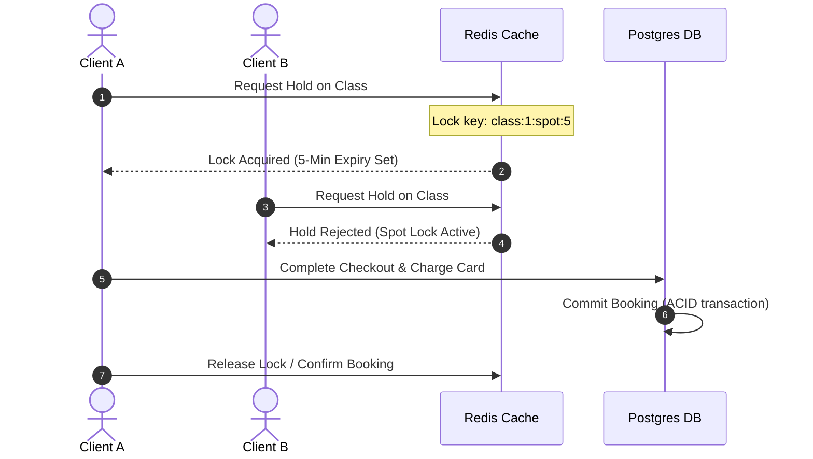

# Evolve Studio POS — Production Readiness & Architecture Checklist

To take a local, mock-based single-user application and transform it into a secure, multi-tenant enterprise system, several standard architectural components must be implemented. Below is a comprehensive gap analysis, database ERD, and production-readiness checklist.

---

## 📐 System & Database Architecture

A production Pilates POS requires a relational database (e.g., PostgreSQL) with strict transaction guarantees (ACID) to prevent double-bookings, alongside a role-based access control (RBAC) security model.

### 1. Database Entity-Relationship Diagram (ERD)

```mermaid
erDiagram
    CUSTOMER ||--o{ BOOKING : places
    CUSTOMER ||--o{ TRANSACTION : executes
    CLASS ||--o{ BOOKING : has
    INSTRUCTOR ||--o{ CLASS : teaches
    MEMBERSHIP_TIER ||--o{ CUSTOMER : assigns
    
    CUSTOMER {
        uuid id PK
        string name
        string email UK
        string phone
        int credits
        uuid tier_id FK
        date birthday
        string[] tags
    }
    
    BOOKING {
        uuid id PK
        uuid class_id FK
        uuid customer_id FK
        int spot_number
        timestamp booked_at
        string status "upcoming | attended | cancelled"
        string payment_method "credit | card | cash"
    }
    
    CLASS {
        uuid id PK
        string title
        string type
        uuid instructor_id FK
        timestamp start_time
        int duration_minutes
        int total_spots
        decimal price
    }
    
    TRANSACTION {
        uuid id PK
        uuid customer_id FK
        string type "booking | membership | refund"
        timestamp timestamp
        string description
        string payment_method
        decimal amount
        string status "paid | pending | cancelled"
        string handled_by "staff_name"
    }
```

---

## 🔒 Concurrency & Spot Hold Architecture

In local storage, tab communication works via custom broadcast channels. In production, hundreds of clients may attempt to book the same spot simultaneously.

### Concurrent Booking Lifecycle (Redis Lock Pattern)



---

## 🗂️ Production Readiness Master Checklist

> [!IMPORTANT]
> The following checklist covers the industry standards required to launch a secure, compliant SaaS fitness portal.

### 1. Security & Compliance
- [ ] **Role-Based Access Control (RBAC):** Restrict backend endpoints based on roles:
  - `Super Admin / Owner` (Cams): View analytics, override credit balances, edit schedules.
  - `Coach / Instructor` (Sarah, Alex): View roster schedules, check in clients, edit their bio.
  - `Front Desk Staff`: Register walk-ins, process POS cash payments, check in clients.
  - `Client`: Book and cancel their own spots.
- [ ] **Session & Token Management:** JWT authentication with secure HttpOnly cookies.
- [ ] **PCI-DSS Compliance:** Never store credit card numbers on database servers. Use Stripe Elements or Stripe Terminal, which send encrypted tokens directly to Stripe's servers.
- [ ] **Audit Trail logs:** An immutable, queryable table mapping all write actions (who modified a client's credit balance, cancelled a booking, or adjusted class rates).

### 2. Database & Data Integrity
- [ ] **Row-level Locks (`SELECT ... FOR UPDATE`):** Ensure that when checking out a class spot, a database transaction locks the spot record to prevent double-booking during concurrent checkouts.
- [ ] **Point-In-Time Database Recovery (PITR):** Enable automated daily backups with transaction log archiving to restore to any exact second in the event of hardware or database failure.
- [ ] **Database Indexing:** Index frequently queried columns (`customer_email`, `class_start_time`, `transaction_timestamp`) to keep UI speeds under 100ms as record volume scales.

### 3. Billing & Financial Integrity
- [ ] **Automatic Tax Calculations:** Integrate local VAT rates (e.g. 12% Philippines VAT) into invoicing workflows.
- [ ] **Stripe Webhooks:** Listen to transaction statuses asynchronously (handles card failures, subscription renewals, refunds, chargebacks).
- [ ] **Financial Reconciliation Log:** Implement a daily reconciliation report comparing Stripe payouts against POS database entries.

### 4. DevOps, Monitoring & Reliability
- [ ] **Distributed Caching (Redis):** Cache active schedules and live class occupancy numbers to reduce Postgres read stress.
- [ ] **Application Performance Monitoring (APM):** Integrate APM systems (e.g., Sentry, Datadog) to alert developers of uncaught frontend crashes or backend database latency.
- [ ] **Rate Limiting:** Protect client routes from brute-force login attempts and scraper bots.
