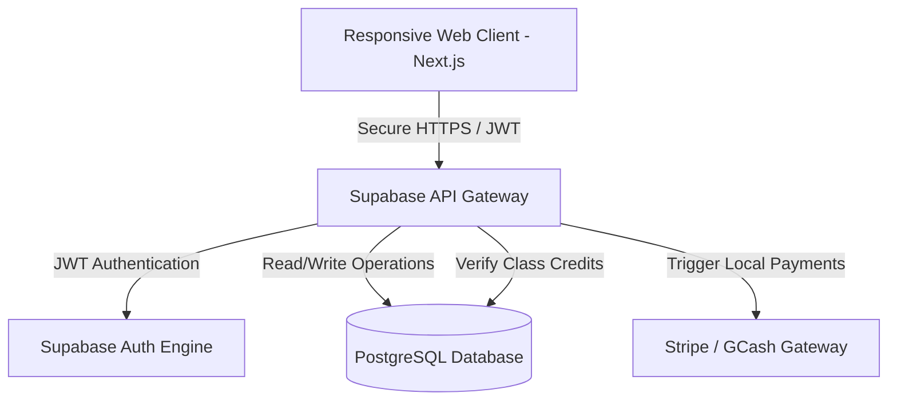
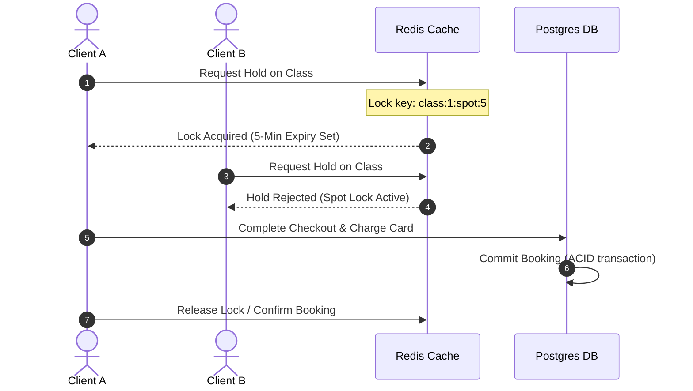

# Project Proposal & Booking Platform Strategy
**Client:** Ervy Bullecer, CEO (Evolve Pole Fitness and Aerial Arts Studio, Davao City)  
**Prepared By:** Developer Team  
**Budget Plan:** ₱60,000.00 PHP (Responsive Web App)  
**Timeline:** 5 Months (20 Weeks)  
**Brand Aesthetic:** Dark Silver, White, and Gray

---

## 🏛️ 1. Executive Summary & Core Objectives

Evolve Pole Fitness and Aerial Arts Studio (Davao City, Philippines) is transitioning from a manual Google Sheets setup to an automated reservation and point-of-sale (POS) web portal. This platform minimizes staff administration work, prevents credit leakage, and guarantees zero double-bookings.

### Administrative Booking Session CRUD Controls
The system implements a secure admin dashboard where the studio owner and front-desk staff have full CRUD (Create, Read, Update, Delete) permissions over class bookings and schedules:
*   **Create/Add Sessions:** Owners can add new scheduled slots (defining the date, start time, coach, facility mapping, capacity bounds, and setup/cleanup buffer times) dynamically.
*   **Edit/Update Sessions:** Authorized admins can modify existing sessions (reassigning coaches, adjusting booking rates, resizing capacities) with automated validation triggers checking for shift collisions.
*   **Cancel/Delete Sessions:** Admins can cancel scheduled sessions or individual bookings, which automatically triggers timely cancellation policies and promotes waiting clients.
*   **Active Class & Pricing Management:** Admins have full administrative authority over the catalog of classes, posting/publishing new class definitions to the public web interface, and modifying credit/monetary pricing structures dynamically based on studio campaigns.

### Client-Side Read-Only Limitations & Progress Reports
*   **Read-Only Profile Status:** Customer accounts are restricted to read-only views for system configurations, schedules, and pricing, ensuring they cannot manually adjust credit balances or schedule shifts.
*   **Dynamic Session Progress Reports:** The platform automatically logs and presents a progress report for every client after each booking session, allowing them to track active milestones and attended histories securely.

### Financial Reporting & Transaction Auditing
*   **Weekly, Monthly & Annual Ledger Exports:** The dashboard contains a financial module that compiles all incoming transactions (cash, cards, credits) into formatted reports weekly, monthly, and annually to help Cams track revenue and audit studio payouts.
*   **Unified Auditable Ledger:** Every credit deduction, refund, or monetary transaction is recorded in an immutable ledger, ensuring a clear audit trail of who performed the update.

### Collaborative Alignment & Project Integrity
*   **Continuous Feedback Loops:** The development cycle is bound by ongoing alignment and review checks, maintaining a direct exchange of design feedback and system walkthroughs between the studio owner and developer to verify that all requirements match operational realities as construction progresses.

### Operational Pain Points & Solutions
*   **The Problem:** High staff overhead from manual scheduling/checking; risk of unverified class credit redemptions; overbooking hazard (strict capacity limit of 5 slots for mountable rig points).
*   **The Solution:** An online booking engine validating credits before reservation, enforcing capacity boundaries (Regular: Max 5 | Masterclass: Min 3, Max 5 | Waitlist: Max 2), and integrating payment gateways.

---

## 💻 2. Unified Tech Stack & Project Architecture

Our engineering workflow leverages a high-efficiency layout. By utilizing **AntiGravity IDE** and **Google Cloud Code** as the central development workspaces, we reduce initial tooling overhead to **₱0.00**, allowing project financing to go directly toward production runtime tools and client-facing intelligence features.

### A. Core Workspace & Development Environment

| Component | Technology | Specific Purpose | Monthly Cost | Cost Status |
| --- | --- | --- | --- | --- |
| **Core Workspace** | **AntiGravity IDE** | The multi-agent visual workspace layer used to layout frontend views, manage local repositories, and map out project files. | **₱0.00** | Native environment access. |
| **Backend Code Space** | **Google Cloud Code** | The development environment/extension used to securely build, deploy, test, and debug backend logic locally. | **₱0.00** | Free developer tooling. |

### B. Live Application Tech Stack & Infrastructure

| Component | Technology | Specific Purpose | Monthly Cost | Cost Status |
| --- | --- | --- | --- | --- |
| **Frontend Framework** | **Next.js 15 (React)** | Core client-facing portal structure and web design execution. Hosted seamlessly on Vercel. | **₱0.00** | Free Tier (Development & Launch phase). |
| **Database & Security** | **Supabase Pro Plan** | Hosted PostgreSQL database with Row-Level Security (RLS) policies to safeguard data. | **~$25.00** | Fixed Subscription. |
| **Domain Management** | **Custodian Domain** | Production web routing address registration. | **~₱75.00** | Prorated from standard ₱900.00/year. |

### C. Integrated APIs (Core Application Features)

| API Component | Vendor / Provider | Specific Feature Purpose inside Code | Monthly Cost | Cost Status |
| --- | --- | --- | --- | --- |
| **Application AI Feature** | **OpenAI ChatGPT API** | Drives the user-facing scheduling assistant, automated summaries, and system alerts *inside* the portal. | **~$20.00** | Metered/Budgeted allocation. |
| **Payments Processing** | **Stripe API** | Natively handles payment collection via credit cards, GCash, and Maya gateways. | **₱0.00** | **Pay-as-you-go** (2.9% fee per successful transaction). |
| **Communication / Alerts** | **Resend API** | Automates transactional onboarding emails, waitlist queues, and check-in QR codes. | **₱0.00** | Free Tier (Up to 3,000 emails/month). |
| **Error Observability** | **Sentry API** | Real-time production tracing to flag system script or database errors instantly. | **₱0.00** | Free Developer Tier. |
| **Code Validation** | **Codecov API** | Continuous automated checking pipeline to ensure code changes do not break payment systems. | **₱0.00** | Free Developer Tier. |

### D. Budget Summary for Project Proposal

*   **Total Fixed Monthly Infrastructure Cost:** **~$25.67 USD** (~₱1,490.00 PHP)
    *   *Includes: Supabase Pro database hosting ($25.00) and prorated Domain tracking (~$0.67).*
*   **Variable Operational Costs:** **~$20.00 USD / month** (~₱1,160.00 PHP)
    *   *Includes: Budgeted allocation for the application-level OpenAI ChatGPT processing engine.*
*   **Transaction-Driven Costs:** **Stripe transaction fees only** (2.9% per successful charge; incurs a ₱0.00 operational cost if no commerce occurs).

---

## 📐 3. System Architecture & Database Design Details

### 1. Data Flow Pipeline
The application utilizes a secure data transmission model mapping client requests through edge networks to a unified database instance:



---

### 2. Relational Schema & Database Parity
The database leverages modern PostgreSQL schemas to enforce Rezerv-style parity features, ensuring robust and transparent studio operations:

*   **Client Profiles & Active Memberships:** Securely stores client profiles, membership tiers, and signed waiver timestamps (automatically restricting bookings if waivers are unsigned).
*   **Instructors & Shift Registry:** Registers coach details (names, bios, active statuses) and aligns session times with their allocated staff shifts to prevent scheduling collisions.
*   **Classes, Courses, & Appointments:** Manages class schedules, bundled course packages, or personal training appointments, enforcing strict capacity boundaries and setup/cleanup buffer times.
*   **Prepaid Wallets & Ledgers:** Implements an append-only transaction ledger that tracks credit points, currency purchases, and refunds in dynamic local currencies.
*   **Facility Layouts & Spot Bookings:** Maps room templates and coordinate layouts (like a theater map) so clients can reserve specific Reformer beds or aerial grids.
*   **Auto-Promotion Waitlist:** Automatically manages waitlists when a session is full, promoting the next client in line and reallocating spots when cancellations happen timely.

---

### 3. Concurrency & Spot Hold Flow (ACID & Row-Level Locking)
To ensure zero double-bookings when multiple customers attempt to book the same reformer or rig spot concurrently:



1. **Spot Reservation Lock:** When Client A selects a slot, an ephemeral lock is set via Redis with a 5-minute expiry.
2. **Overlap Interception:** Any booking attempt from Client B is immediately rejected.
3. **Transaction Commit:** Once client payment processes successfully, the SQL booking state completes atomically in PostgreSQL.

---

## ⏱️ 4. 5-Month Phased Rollout (Weekly Timeline)

The 20-week build cycle ensures a structured execution path:

### Month 1: Interface & Database Design (Weeks 1 - 4)
*   **Week 1:** UI/UX layout design (Dark Silver, White, and Gray theme).
*   **Week 2:** Setup PostgreSQL schema tables and relational keys.
*   **Week 3:** Create data seed scripts (packages, coaches, facilities).
*   **Week 4:** UI layout styling (navigation header, dashboard skeleton, class grids).
*   *Milestone: UI Mockup Sign-off*

### Month 2: Auth Setup & Database Integration (Weeks 5 - 8)
*   **Week 5:** Integrate Supabase client auth and credentials setup.
*   **Week 6:** Setup Social logins (Google, Apple) and JWT auth redirect routers.
*   **Week 7:** Enable Row-Level Security (RLS) policies and RBAC views.
*   **Week 8:** Build client profiles management dashboard views.
*   *Milestone: Auth & Profile Integration*

### Month 3: Booking Engine & Capacity Logic (Weeks 9 - 12)
*   **Week 9:** Class schedules lists page, filtering by format and coach.
*   **Week 10:** Grid layout mapping for spot selections (rig points).
*   **Week 11:** Booking capacity triggers setup (Max 5 rules, Max 2 waitlist constraints).
*   **Week 12:** Class cancellation engine and waitlist promotion triggers testing.
*   *Milestone: Booking Engine Demo*

### Month 4: Payment API Integration & Notifications (Weeks 13 - 16)
*   **Week 13:** Stripe Checkout SDK integration for packages.
*   **Week 14:** Stripe webhook routing to increment customer credit balances.
*   **Week 15:** Resend Email API setup for transactional emails and QR code confirmations.
*   **Week 16:** Setup admin credit manually overriding logic.
*   *Milestone: Stripe & Payment Gateway Demo*

### Month 5: QA, Sheets Migration & Launch (Weeks 17 - 20)
*   **Week 17:** Export Google Sheets data, script formatting, and CSV validation.
*   **Week 18:** Import script execution to seed current customers and credit balances.
*   **Week 19:** Comprehensive QA testing, boundary checks, and security rule audits.
*   **Week 20:** Connect domain names, configure production environment keys, and launch!
*   *Milestone: Production Live Deployment*

### 🕹️ Gamified Client Progress & Module Unlocking Roadmap
To incentivize continuous pole fitness and aerial training, the platform maps client sessions to a gamified sequence of project reports and milestone checkpoints:
*   **Sequential Module Gates:** Client areas/features are segmented into progressive modules (e.g., Module 1: Introductory Flow -> Module 2: Intermediate Inversions -> Module 3: Masterclass Artistry).
*   **Checklist Star Verification:** At the end of each module block, a custom **Project Progress Report** generates containing a 3-star checklist criteria.
*   **Unlock Conditions:** When coaches submit and verify a client has achieved all 3 stars in their current module checklist, the system flags the profile database row as upgraded, instantly unlocking access to select spots and book sessions within the next module gate.

---

## 💰 5. Cost Breakdown & Payment Milestones

### Estimated Initial Development Cost (₱350 / Hour Base Rate)
| Phase Scope | Est. Hours | Option B: Web App | Option A: Mobile App |
| :--- | :--- | :--- | :--- |
| **UI/UX Design & Typography** | 30h - 45h | ₱11,000.00 | ₱15,750.00 |
| **Database Architecture & Migration** | 40h - 50h | ₱14,000.00 | ₱17,500.00 |
| **Frontend Development & Booking System** | 80h - 140h | ₱28,000.00 | ₱49,000.00 |
| **GCash/Maya Payment API Integration** | 20h - 35h | ₱7,000.00 | ₱12,250.00 |
| **App Store Developer Registration Fees** | - | ₱0.00 | ₱7,300.00 *(Fixed)* |
| **TOTAL ESTIMATED COST** | **170h - 270h** | **₱60,000.00** | **₱101,800.00** |

---

### Payment Milestone Options (With ₱5,000 Tech Retainer)

Each option is initiated with an immediate **₱5,000.00 Setup Deposit** (to secure domain, ChatGPT, Supabase Pro, Vercel, and emails), with the remaining balance split as follows:

```
[Web Application Balance]:   ₱60,000.00 - ₱5,000.00 = ₱55,000.00 remaining
[Mobile Application Balance]: ₱101,800.00 - ₱5,000.00 = ₱96,800.00 remaining
```

#### Option 1: The Balanced 4-Way Milestone Structure
*   **Startup Deposit:** ₱5,000.00
*   **Payment 2 (Mid-Design):** ₱20,000.00 *(Web App)* / ₱35,000.00 *(Mobile App)* — Released upon design sign-off.
*   **Payment 3 (Staging Demo):** ₱20,000.00 *(Web App)* / ₱35,000.00 *(Mobile App)* — Released upon database and scheduling demo.
*   **Payment 4 (Final Rollout):** ₱15,000.00 *(Web App)* / ₱26,800.00 *(Mobile App)* — Released upon legacy migration and live rollout.

#### Option 2: The Bi-Weekly Steady Flow (Every 2 Weeks for 4 Months)
*   **Startup Deposit:** ₱5,000.00
*   **8 Bi-Weekly Installments:**
    *   **Web App:** ₱6,875.00 / bi-weekly payment.
    *   **Mobile App:** ₱12,100.00 / bi-weekly payment.

#### Option 3: The Micro-Weekly Split (Every Week for 4 Months)
*   **Startup Deposit:** ₱5,000.00
*   **16 Weekly Installments:**
    *   **Web App:** ₱3,438.00/week (Weeks 1-8) and ₱3,437/week (Weeks 9-16).
    *   **Mobile App:** ₱6,050.00 / week (Weeks 1-16).

---

## ⚠️ 6. Milestone Late Payment & Penalty Terms

To maintain steady project momentum and guarantee mutual commitment, a strict payment schedule is enforced:

*   **Payment 1 (Mid-Design) Delay:** No backend coding or database integration starts until Payment 1 clears. A delay past **5 business days** from design mockup sign-off postpones timeline deadlines and adds a flat **₱1,500.00** administration fee.
*   **Payment 2 (Staging Demo) Delay:** Due within **5 days** of demo approval. If unpaid by Day 6, **all staging development work is suspended**. If unpaid past **10 business days**, a **5% late surcharge** is added to the milestone value.
*   **Payment 3 (Final Rollout) Delay:** Due within **5 days** of UAT sign-off. If unpaid by Day 6, **live rollout, domain transfer, and legacy migration are suspended**. If unpaid past **10 business days**, a **5% late surcharge** is added to the milestone value.

---

## 🤝 7. Developer Performance & Delivery Guarantees

To protect the client's investment, the developer is bound by reciprocal deadlines:

*   **Staging Milestone Delay:** Failing to deliver the staging engine demo within **10 business days** of the target date applies a **5% discount** to the upcoming Payment 2 per week of delay.
*   **Rollout Milestone Delay:** Failing to execute live rollout within **10 business days** of UAT approval applies a **5% discount** to the final Payment 3 per week of delay.

---

## 📈 8. Support & Operations Packages

To ensure operations continue smoothly, Cams Rivera can select one of three monthly maintenance structures:

*   **Package 1: Launch & Hand-off (Self-Managed - ₱0/mo):** Includes full source code turnover, setup logs, and a 15-day post-launch bug warranty. Developer performs no active daily server oversight or backups verification. Future administrative changes, feature modifications, schedule mappings, or billing updates are charged ad-hoc at a standard developer rate of **₱500.00 / hour**.
*   **Package 2: Managed Growth (Recommended - ₱3,500/mo):** Developer oversees server performance monitoring, database backup verification audits, code bug warranty resolution, application security patches, OAuth options verification (Google/Apple authentication), and up to **3 hours** of monthly edits (which consist of adding, modifying, or removing features, updating schedules, and adjusting package pricing details).
*   **Package 3: Premium Scaling (All-Inclusive - ₱5,999/mo):** Includes active real-time telemetry monitoring, automated alert channels, database health tuning, priority developer support turnaround (responses within 12 hours), and up to **5 hours** of dedicated monthly developer tasks (covering adding new features, adjusting layouts, custom exports, and schedule maintenance).
