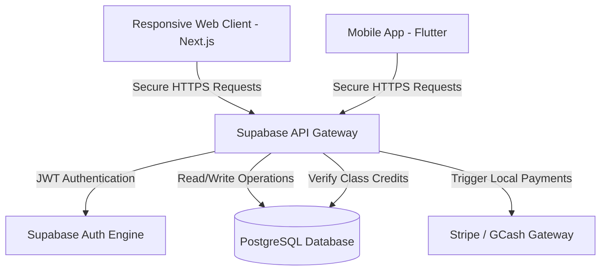
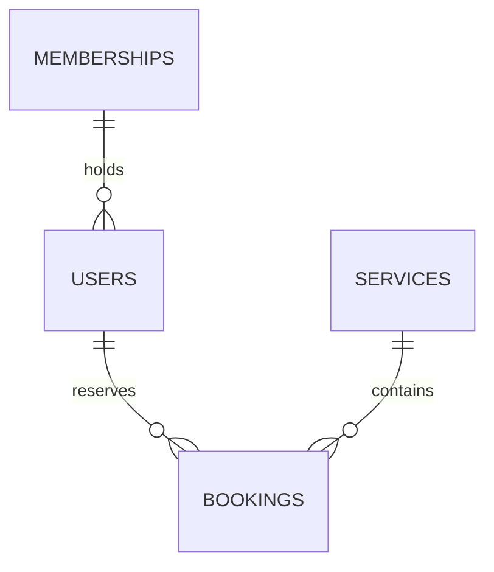

# Technical Proposal & Booking Platform Strategy
**Prepared for Evolve Pole Fitness and Aerial Arts Studio**

---

## Slide 1: Title Slide & Project Introduction
**Visual: Premium, Minimalist, Dark Theme (Black, Grey, White) - Studio Logo Placeholder**
* **Project Name:** Custom Reservation & Studio Management Platform
* **Prepared For:** Ervy Bullecer, CEO
* **Client Contact:** tweetiebullecer@gmail.com | +639151833369
* **Studio Profile:** Evolve Pole Fitness and Aerial Arts Studio (Davao City, Philippines)
* **Presenter:** Junior Fullstack Developer [Your Name / Evolve Studio]

*Developer Note (What to say): "Good day, Ms. Ervy. I have analyzed Evolve Studio’s booking workflow. Today, I am presenting a technical blueprint to move your system away from manual recording and Google Sheets into an automated, premium reservation platform that scales with your growing fitness community."*

---

## Slide 2: Project Objectives & Pain Point Resolution
**Visual: Before (Pain Points) vs. After (System Benefits)**
* **The Problem:** Manual attendance tracking, missed membership payments, difficult schedule changes, and overbooked classes (max 5 capacity rule).
* **The Solution:** A centralized online booking engine that:
  * Automates class credit verification (clients can't book without active credits).
  * Automatically enforces class size rules (Regular: Min 1, Max 5 | Special: Min 3, Max 5 | Waitlist size of 2).
  * Integrates direct payments (Cash, Bank Transfer, GCash) with automatic receipt tracking.
  * Replaces Google Sheets with structured, real-time records.

---

## Slide 3: Unified Tech Stack (Davao Studio Scaled)
**Visual: Tech stack logo matrix**
* **Frontend Web (Option B):** Next.js (React) + Tailwind CSS (Premium, Minimalist, Dark/Light Mode toggle).
* **Frontend Mobile (Option A):** Flutter (Fast native compilation for iOS and Android).
* **Database & Auth:** Supabase (PostgreSQL engine) — secure, real-time, relational storage.
* **Authentication:** Secure Email/Password, Google Login, and Apple Login with built-in Forgot Password and Two-Factor Security.
* **Payments System:** Stripe Gateway API (Pre-configured to support local methods: GCash, Maya, and credit cards).

---

## Slide 4: System Architecture Diagram
**Visual: Simplified database and request flow**

---

## Slide 5: API Architecture & Security
**Visual: Shield icon indicating secure layers**
* **API Standard:** RESTful JSON communication over SSL-encrypted HTTPS tunnels.
* **Row-Level Security (RLS):** Database policies ensure clients only view their own bookings, while coaches can only view classes they are rostered to teach.
* **Booking Rules (API Level Validation):**
  * `POST /bookings/create` checks if the class is already at max capacity (5 slots).
  * If full, it checks if the waitlist has open space (max 2 slots) and adds the user to the waitlist queue.
  * Verifies if a user has active packages or class credits *before* confirming.

---

## Slide 6: Database Architecture (Relational Design)
**Visual: Database relationship diagram**

* **Memberships Table:** Tracks active packages (credits remaining, expiration dates).
* **Bookings Table:** Holds registration records. Implements database constraints to guarantee zero double-bookings.
* **Class Capacity Rules:** Enforces cancellation deadlines, sudden cancellation blocks, and automated waitlist promotions directly at the database level.

---

## Slide 7: Mobile App vs. Responsive Web App
| Feature | Option A: Native Mobile App | Option B: Responsive Web App |
| :--- | :--- | :--- |
| **Availability** | App Store / Google Play Store | Any Browser (Safari, Chrome, etc.) |
| **Client Friction** | High (Requires install/updates) | Very Low (Scan QR code at Davao studio to book) |
| **Discovery (SEO)**| Low (Hidden inside app stores) | High (Find Evolve Davao on Google Search) |
| **Studio Updates** | Subject to App Store approval (days) | Instant publish (seconds) |
| **Part-Time Dev Timeline**| ~7 Months | ~5 Months |

---

## Slide 8: Development Timeline (Part-Time Student Plan)
**Visual: 5-Month Roadmap Gantt Chart**
* **Month 1: Interface & Database Design (Weeks 1 - 4)**
  * Design the premium minimalist dark mode interface; build PostgreSQL table configurations.
* **Month 2: Auth Setup & Database Integration (Weeks 5 - 8)**
  * Implement Google/Apple Login and database rules (RLS) to secure client profiles.
* **Month 3: Booking Engine & Capacity Logic (Weeks 9 - 12)**
  * Code calendar reservations. Build the strict capacity limits (Regular: Max 5, Special: Min 3, Waitlist: Max 2).
* **Month 4: Stripe/GCash Payments & Notifications (Weeks 13 - 16)**
  * Integration of local payment checkouts and email reminders. *(Includes 1 week buffer for academic exams).*
* **Month 5: Final QA, Sheet Data Migration & Launch (Weeks 17 - 20)**
  * Migrating records from current Google Sheets into the new platform; deployment to production.

---

## Slide 9: Realistic Cost Breakdown (Junior PH Rate Base)
*Based on a junior fullstack developer rate of **₱350 / hour** (extremely cost-effective for Evolve Studio).*

| Phase & Scope | Est. Hours | Option A: Mobile App | Option B: Web App |
| :--- | :--- | :--- | :--- |
| **UI/UX Design (Minimalist/Wellness)** | 30h - 45h | ₱15,750 | ₱10,500 |
| **Database Architecture & Sheets Migration**| 40h - 50h | ₱17,500 | ₱14,000 |
| **Frontend Development & Booking System** | 80h - 140h | ₱49,000 | ₱28,000 |
| **GCash/Maya Payment API Integration** | 20h - 35h | ₱12,250 | ₱7,000 |
| **App Store Developer Registration Fees** | - | ₱7,300 *(Fixed Store Fees)* | ₱0 |
| **TOTAL INITIAL DEVELOPMENT COST** | **170h / 270h** | **₱101,800** | **₱59,500** |

---

## Slide 10: Infrastructure Capacity & Cost Per User
* **1. Admin & Staff Accounts (Coaches/Owner)**
  * **Cost:** **₱0.00 / Admin Account** (Always Free).
  * **Limit:** Unlimited seats. You can add all 5 of your current coaches/staff at zero extra license fees.
* **2. Client Accounts (Evolve Davao Community)**
  * **Free Capacity:** Up to **50,000 monthly active users** at **₱0.00** total database cost.
  * **Scaling Cost:** If you scale past 50,000 registered active users, the database upgrades to a flat ₱1,400/month ($25) tier.
* **3. Server Bandwidth & Hosting**
  * **Free Capacity:** Up to **100 GB / month** (covers ~80,000 visits) at **₱0.00** using Vercel.

---

## Slide 11: Implementation & Support Packages
### Managed Options for a Stress-Free Launch

#### Package 1: Launch & Hand-off (Self-Managed)
* **Upfront Dev Cost:** **₱59,500** (Web) / **₱101,800** (Mobile)
* **Monthly Support Cost:** **₱0**
* **Includes:** Platform setup, 30-day bug warranty, source code delivery.
* **Best for:** Self-managed hosting; future updates billed ad-hoc (₱500/hr).

#### Package 2: Studio Growth (Managed Support) - *RECOMMENDED*
* **Upfront Dev Cost:** **₱59,500** (Web) / **₱101,800** (Mobile)
* **Monthly Support Cost:** **₱3,500 / month**
* **Includes:**
  * Active server monitoring and uptime maintenance.
  * Up to **3 hours** of monthly updates (adjusting schedule, pricing updates, adding new coaches).
  * Secure backup maintenance.

#### Package 3: Premium Scaling (All-Inclusive)
* **Upfront Dev Cost:** **₱59,500** (Web) / **₱101,800** (Mobile)
* **Monthly Support Cost:** **₱7,000 / month**
* **Includes:** Up to **7 hours** of developer tasks per month, priority support response, database optimization reports.

---

## Slide 12: Senior Developer Recommendations & Next Steps
* **Phase 1 Strategy: Start with a Responsive Web Application under Package 2**
  * **Immediate SEO Reach:** Locals searching for "pole fitness Davao" land directly on your booking page.
  * **Low-Friction Conversions:** Clients can book via Facebook/Instagram link click without App Store friction.
* **Phase 2 Migration Path (Google Sheets to DB):**
  * Export existing client names and package credits from Google Sheets into CSV.
  * Program a migration script during Month 5 to seed the Supabase database.
* **Phase 3 Future Scalability:**
  * Once the Web App runs stably for 6 months, wrap the website code into a native wrapper (using Flutter/Capacitor) to publish on mobile stores.
* **Next Steps:**
  1. Approve the Web App development plan.
  2. Select and register the custom domain (₱600–₱900/year).
  3. Begin UI design mockups for Month 1.
